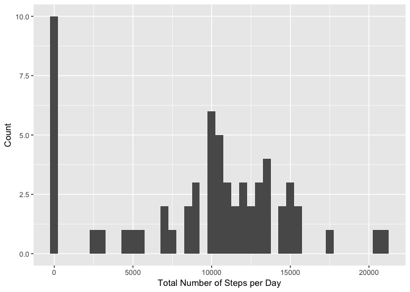
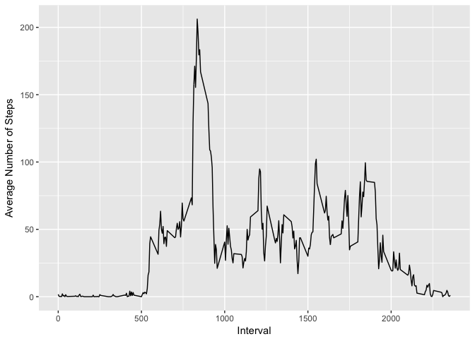
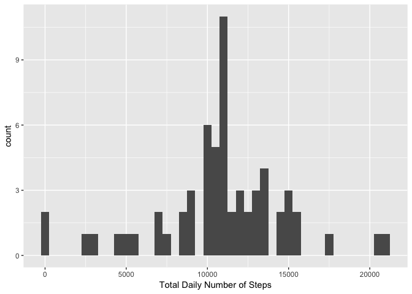
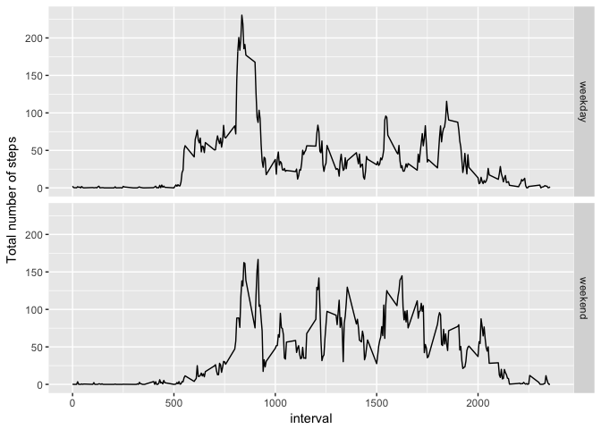

Reproducible Research: Prog Assignment 1
================
jsquiers
5/16/2017

Introduction
------------

It is now possible to collect a large amount of data about personal movement using activity monitoring devices such as a Fitbit, Nike Fuelband, or Jawbone Up. These type of devices are part of the “quantified self” movement – a group of enthusiasts who take measurements about themselves regularly to improve their health, to find patterns in their behavior, or because they are tech geeks. But these data remain under-utilized both because the raw data are hard to obtain and there is a lack of statistical methods and software for processing and interpreting the data.

This assignment makes use of data from a personal activity monitoring device. This device collects data at 5 minute intervals through out the day. The data consists of two months of data from an anonymous individual collected during the months of October and November, 2012 and include the number of steps taken in 5 minute intervals each day.

Data
----

Dataset: Activity monitoring data \[52K\]

The variables included in this dataset are:
- steps: Number of steps taking in a 5-minute interval (missing values are coded as NA)
- date: The date on which the measurement was taken in YYYY-MM-DD format
- interval: Identifier for the 5-minute interval in which measurement was taken

The dataset is stored in a comma-separated-value (CSV) file and there are a total of 17,568 observations in this dataset.

Load relevant packages for the assignment and set working directory
-------------------------------------------------------------------

``` r
library(plyr)
library(ggplot2)
```

Loading and preprocessing the data
----------------------------------

Show any code that is needed to:

1.  Load the data (i.e. read.csv())

``` r
activity <- read.csv("activity.csv") #load data from provided .csv file
```

1.  Process/transform the data into a format suitable for your analysis

``` r
activity$date <- as.POSIXct(activity$date) #change date variable to POSIXct 
```

What is the mean total number of steps taken per day?
-----------------------------------------------------

For this part of the assignment, you can ignore the missing values in the dataset.

1.  Calculate the total number of steps taken per day

``` r
#sum steps in each interval by day to determine total number of steps taken per day and store in dataframe stepsperday; ignore NA values
stepsperday <- aggregate(activity$steps, by = list(activity$date), sum, na.rm=TRUE)

#name columns in stepsperday dataframe with Date and steps (total number of steps)
names(stepsperday) <- c("Date","steps")
```

1.  Make a histogram of the total number of steps taken each day

``` r
#plot histogram of total number of steps per day using stepsperday dataframe
qplot(steps, data=stepsperday, geom = "histogram", xlab = "Total Number of Steps per Day", ylab = "Count", binwidth=500)
```



1.  Calculate and report the mean and median of the total number of steps taken per day

``` r
#report the mean total number of steps taken per day
mean.steps <- mean(stepsperday$steps)
paste("The mean number of total steps per day is", mean.steps)
```

    ## [1] "The mean number of total steps per day is 9354.22950819672"

``` r
#calculate and report median total number of steps taken per day
median.steps <- median(stepsperday$steps)
paste("The median number of total steps per day is", median.steps)
```

    ## [1] "The median number of total steps per day is 10395"

What is the average daily activity pattern?
-------------------------------------------

1.  Make a time series plot (i.e. type="1") of the 5-minute interval (x-axis) and the average number of steps taken, averaged across all days (y-axis)

``` r
#calculate average number of steps taken in each 5-minute interval averaged across all days and store in dataframe intstepsmean
intstepsmean <- aggregate(activity$steps, by = list(activity$interval),mean,na.rm=TRUE)

#name columns of dataframe instepsmean as interval and mean.steps
names(intstepsmean) = c("interval","mean.steps")

#make time series plot with 5-minute intervals on x-axis and average number of steps taken within each interval (averaged across all days) on y-axis
ggplot(intstepsmean, aes(x = interval, y = mean.steps)) + geom_line() + labs(x = "Interval", y = "Average Number of Steps")
```



1.  Which 5-minute interval, on average across all the days in the dataset, contains the maximum number of steps?

``` r
#calculate and report the 5-minute interval, averaged across all days, with the maximum number of steps
maxsteps <- intstepsmean$interval[intstepsmean$mean.steps == max(intstepsmean$mean.steps)]
paste("The 5-minute interval, on average across all the days in the dataset, that has the maximum number of steps is interval", maxsteps)
```

    ## [1] "The 5-minute interval, on average across all the days in the dataset, that has the maximum number of steps is interval 835"

Imputing missing values
-----------------------

Note that there are a number of days/intervals where there are missing values (coded as NA). The presence of missing days may introduce bias into some calculations of summaries of the data
1. Calculate and report the total number of missing values in the dataset (i.e. the total number of rows with NAs)

``` r
#create dataframe subset of rows with NAs in steps column
na.steps <- subset(activity, is.na(steps))
#count and report number of rows with NAs
num.NAs <- nrow(na.steps)
paste("The total number of mssing values in the dataset (i.e. the toal number of rwos with NAs) is", num.NAs)
```

    ## [1] "The total number of mssing values in the dataset (i.e. the toal number of rwos with NAs) is 2304"

1.  Devise a strategy for filling in all the missing values in the dataset. The strategy does not need to be sophisticated. For example, you could use the mean/median for that day, or the mean for that 5-minute interval, etc.

``` r
#replace all NAs with the mean number of steps for that interval
imputedsteps <- data.frame(date = activity$date[is.na(activity$steps)], interval = activity$interval[is.na(activity$steps)], steps = intstepsmean[match(intstepsmean$interval, activity$interval[is.na(activity$steps)]),2])
```

1.  Create a new dataset that is equal to the original dataset but with missing data filled in.

``` r
#remove NAs from original dataset
activity <- subset(activity, !is.na(steps))
#bind the mean number of steps for corresponding interval in place of removed NAs
activity <- rbind(activity,imputedsteps)
```

1.  1.  Make a histogram of the total number of steps taken each day and calculate and report the **mean** and **median** total number of steps taken per day.

``` r
#calculate total number of steps each day and store in dataframe totaldailysteps
totaldailysteps <- aggregate(activity$steps, by = list(activity$date),sum,na.rm=TRUE)
#name columns of dataframe totaldailysteps as Date and steps
names(totaldailysteps) <- c("Date","steps")

#plot histogram of the total number of steps taken each day
qplot(steps, data = totaldailysteps, geom="histogram", xlab = "Total Daily Number of Steps", binwidth = 500)
```



``` r
#report mean and median total number of steps taken per day
paste("The mean total number of steps taken per day is", round(mean(totaldailysteps$steps)))
```

    ## [1] "The mean total number of steps taken per day is 10766"

``` r
paste("The median total number of steps taken per day is",round(median(totaldailysteps$steps)))
```

    ## [1] "The median total number of steps taken per day is 10766"

1.  Do these values differ from the estimates from the first part of the assignment? What is the impace of imputing missing data on the estimates of the total daily number of steps?
    By imputing missing values using the mean, the reported values for mean and median number of total daily steps both change. The mean increased from 9354 to 10766, and the median increased from 10395 to 10766. After imputation in this manner, the mean and median are the same.

Are there differences in activity patterns between weekdays and weekends?
-------------------------------------------------------------------------

For this part the weekdays() function may be of some help here. Use the dataset with the filled-in missing values for this part
1. Create a new factor variable in the dataset with two levels: "weekday" and "weekend" indicating whether a given date is a weekday or weekend day.

``` r
#add day of weekday/weekend identifier to activity dataframe
activity$day <- ifelse(weekdays(activity$date) == "Saturday" | weekdays(activity$date) == "Sunday", "weekend", "weekday")
```

1.  Make a panel plot containing a time series plot (i.e. type="1") of the 5-minute interval (x-axis) and the average number of steps taken, averaged across all weekday days or weekend days (y-axis). See the README file in the GitHub repository to see an example of what this plot should look like using simulated data.

``` r
#create dataframe with mean total number of steps taken, averaged across all days, that maintains weekday/weekend identifier
intstepsmean2 <- aggregate(activity$steps, by = list(activity$day,activity$interval), mean, na.rm=TRUE)
#name columns of intstepsmean2 dataframe as weekday, interval, and mean.steps
names(intstepsmean2) = c("weekday", "interval", "mean.steps")
#make panel plot showing average number of steps taken per 5-minute interval across all weekday days or weekend days
ggplot(intstepsmean2, aes(x=interval, y=mean.steps)) + ylab("Total number of steps") + geom_line() + facet_grid(weekday~.)
```



Based on these results, it appears that the subject of this dataset begins walking slightly later on the weekends (perhaps they sleep in) and walks more on weekends. They also continue to walk later into the day on weekends (perhaps they stay up a bit later?)
